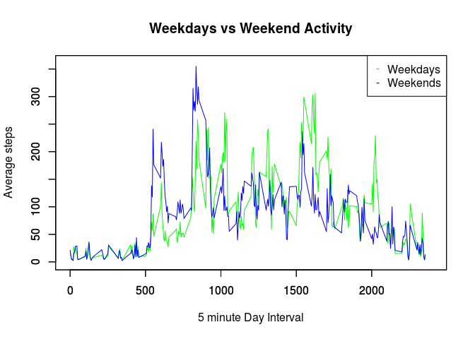

# Reproducible Research: Peer Assessment 1


## Loading and preprocessing the data
Here is the R code to load the file "activity.csv" into a data table:

```r
library("data.table")
#We assume the file is already in the working directory
rawActData<-data.table(read.csv("activity.csv",colClasses=c("numeric","factor","numeric")))
#Coerce the "date" variable to fit into a Date format
rawActData$date<-as.Date(rawActData$date,"%Y-%m-%d")
```
Now we make a quick inspection of the data:

```r
summary(rawActData)
```

```
##      steps             date               interval     
##  Min.   :  0.00   Min.   :2012-10-01   Min.   :   0.0  
##  1st Qu.:  0.00   1st Qu.:2012-10-16   1st Qu.: 588.8  
##  Median :  0.00   Median :2012-10-31   Median :1177.5  
##  Mean   : 37.38   Mean   :2012-10-31   Mean   :1177.5  
##  3rd Qu.: 12.00   3rd Qu.:2012-11-15   3rd Qu.:1766.2  
##  Max.   :806.00   Max.   :2012-11-30   Max.   :2355.0  
##  NA's   :2304
```
We saw that from the measures of central locations  the Median looked strange, because if the Mean=37.38 and Max=806, then the Median should be higher. We did a frequency table over the "steps" variable to see what was happening and we found out that…

```r
stepFT<-table(rawActData$steps)
head(stepFT);tail(stepFT)
```

```
## 
##     0     1     2     3     4     5 
## 11014     7     8     3    25    17
```

```
## 
## 785 786 789 794 802 806 
##   3   1   1   1   1   1
```
There exists a disproportion of zeros. We decided to consider zero steps equivalent to NA, because it is unlikely that people give no steps in a day, it does not add information and biases the compute of measures of central tendency.

## What is mean total number of steps taken per day?
In order to compute aggregations, we will first filter the NAs and the Zeros from the raw data as follows:

```r
#Eliminate NAs and Zeros
noNasZActData<-rawActData[!is.na(rawActData$steps) & (rawActData$steps>0)]
```
Now we compute the sum of the total steps per day:

```r
#Compute the Daily activity
noNasZDailySteps<-noNasZActData[,list(totalSteps=sum(steps)),by="date"]
#Show the results
noNasZDailySteps
```

```
##           date totalSteps
##  1: 2012-10-02        126
##  2: 2012-10-03      11352
##  3: 2012-10-04      12116
##  4: 2012-10-05      13294
##  5: 2012-10-06      15420
##  6: 2012-10-07      11015
##  7: 2012-10-09      12811
##  8: 2012-10-10       9900
##  9: 2012-10-11      10304
## 10: 2012-10-12      17382
## 11: 2012-10-13      12426
## 12: 2012-10-14      15098
## 13: 2012-10-15      10139
## 14: 2012-10-16      15084
## 15: 2012-10-17      13452
## 16: 2012-10-18      10056
## 17: 2012-10-19      11829
## 18: 2012-10-20      10395
## 19: 2012-10-21       8821
## 20: 2012-10-22      13460
## 21: 2012-10-23       8918
## 22: 2012-10-24       8355
## 23: 2012-10-25       2492
## 24: 2012-10-26       6778
## 25: 2012-10-27      10119
## 26: 2012-10-28      11458
## 27: 2012-10-29       5018
## 28: 2012-10-30       9819
## 29: 2012-10-31      15414
## 30: 2012-11-02      10600
## 31: 2012-11-03      10571
## 32: 2012-11-05      10439
## 33: 2012-11-06       8334
## 34: 2012-11-07      12883
## 35: 2012-11-08       3219
## 36: 2012-11-11      12608
## 37: 2012-11-12      10765
## 38: 2012-11-13       7336
## 39: 2012-11-15         41
## 40: 2012-11-16       5441
## 41: 2012-11-17      14339
## 42: 2012-11-18      15110
## 43: 2012-11-19       8841
## 44: 2012-11-20       4472
## 45: 2012-11-21      12787
## 46: 2012-11-22      20427
## 47: 2012-11-23      21194
## 48: 2012-11-24      14478
## 49: 2012-11-25      11834
## 50: 2012-11-26      11162
## 51: 2012-11-27      13646
## 52: 2012-11-28      10183
## 53: 2012-11-29       7047
##           date totalSteps
```
From the previous aggregation, we can see there is information about 53 different days, from 2012/10/02 to 2012/11/29.<p/>
On the other hand, if we aggregate from the raw data we can see there are six days we are not considering because no activity was accounted for that days:

```r
#Aggretate raw data
rawDailyAct<-rawActData[,list(totalSteps=sum(steps,na.rm = TRUE)),by="date"]
#Days with NAs
rawDailyAct[rawDailyAct$totalSteps==0]
```

```
##          date totalSteps
## 1: 2012-10-01          0
## 2: 2012-10-08          0
## 3: 2012-11-01          0
## 4: 2012-11-04          0
## 5: 2012-11-09          0
## 6: 2012-11-10          0
## 7: 2012-11-14          0
## 8: 2012-11-30          0
```

We show the histogram of the daily activity.

```r
#Plot the Histogram
hist(noNasZDailySteps$totalSteps,xlab = "Daily Steps", main="Total Daily Steps ", col="cyan")
```

<!-- -->

Now we compute the mean and median of the daily activity:

```r
noNasZDailySteps[,list(meanDailySteps=mean(totalSteps),medianDailySteps=median(totalSteps))]
```

```
##    meanDailySteps medianDailySteps
## 1:       10766.19            10765
```

## What is the average daily activity pattern?
First compute the average steps computed for every day.

```r
#Compute the average of steps given each day
noNasZAvgDailySteps<-noNasZActData[,list(avgSteps=mean(steps)),by="date"]
#Add the  avgSteps variable to the noNasZActData
noNasZActData<-merge(noNasZActData,noNasZAvgDailySteps,by="date")
#Add a day id to distinguish day intervals
noNasZActData<-noNasZActData[order(date,interval)]
noNasZActData[,dateID := .GRP, by ="date"]
```

Now we will plot the average daily steps across each interval:

```r
#Each unit in the x axis represent an interval, 10 units represent a hole day
plot((noNasZActData$interval+(noNasZActData$dateID*100000))/10000,noNasZActData$avgSteps,type="l",, xlim=c(0,535), ylim=c(0,250), xlab = "5 Minute Intervals (One day X 10, One Interval X 1)", ylab = "Average Steps per Day", main="Average Daily Steps over 53 days ")
```

<!-- -->

To find the 5-minute interval with the highest Average steps per day we most compute the average across each interval, and then find the maximum:

```r
#Compute the average over the 5 minute intervals
intervalStepAvg<-noNasZActData[,list(avgSteps=mean(steps)),by="interval"]
#Compute the maximum
intervalStepAvg[intervalStepAvg$avgSteps==max(intervalStepAvg$avgSteps),]
```

```
##    interval avgSteps
## 1:      835 352.4839
```

## Imputing missing values
Some times it may be appropriate  to interpolate and impute values where we have missing values in a given data set by inferring the missing data from real data.
Since we considered the Zeros equivalent to the missing values we may account this values too.

Now we will compute the total number of missing values in the dataset (i.e. the total number of rows with NAs and Zeros)

```r
totalNas<-nrow(rawActData[is.na(rawActData$steps) | (rawActData$steps==0)])
totalNas
```

```
## [1] 13318
```

The criterion we will use is to calculate the average of each interval across all days and assign this value to the corresponding interval when ever a Na is found, multiplied by a weigth. In this case the weight is equal to 0.55. However, the Na values will remain for those intervals where a  valid average could not be computed previously because there was not enough information available.
<p/>
We will take the average over the 5 minute intervals that we computed previously for the previous section:

```r
intervalStepAvg
```

```
##      interval avgSteps
##   1:     2210   63.750
##   2:     2215   56.375
##   3:      410   34.000
##   4:      430   43.600
##   5:      535   64.200
##  ---                  
## 265:     2255  122.000
## 266:      320   11.000
## 267:     2240   17.000
## 268:      325   33.000
## 269:      115   18.000
```
Now let's create a new dataset with a "imputed step"" variable from the original:

```r
#Stablish the weight of the imputation:
weight<-0.55
#Create the new step column in our original dataset
rawActData$istep<-rawActData$step
#Find the intervals with Nas or Zeros
intervalsWithNasZ<-unique(rawActData[is.na(rawActData$step),]$interval)
#For each interval with Nas
for(i in 1:length(intervalsWithNasZ)){
  hasAvg<-sum(intervalStepAvg$interval==intervalsWithNasZ[i])
  #If there exist a valid average to impute for the corresponding interval
  if(!is.na(hasAvg) & hasAvg>0){
    #Makes the imputation with a weight
    rawActData$istep[is.na(rawActData$steps) & (rawActData$interval==intervalsWithNasZ[i])]<-intervalStepAvg$avgSteps[intervalStepAvg$interval==intervalsWithNasZ[i]] *weight
 }
}
#Set the original zeros to NAS
rawActData$istep[rawActData$istep==0]<-NA
#Now generate a anew data set free of NAS and Zeros with the imputed values
impActData<-rawActData[!is.na(rawActData$istep),]
#Remove the original step column from the new dataset
impActData$steps<-NULL
```
Now the new Nas count is lower:

```r
totalNasImputed<-nrow(rawActData[is.na(rawActData$istep)])
c(NewNas=totalNasImputed,OldNas=totalNas)
```

```
## NewNas OldNas 
##  11166  13318
```
Now let's compare the Imputed vs the original distribution:

```r
#Compute the Daily activity
impZDailySteps<-impActData[,list(totalSteps=sum(istep)),by="date"]
#Plot and compare Histograms
par(mfrow = c(1,2))
hist(noNasZDailySteps$totalSteps,xlab = "Daily Steps", main="Total Daily Steps ", col="cyan")
hist(impZDailySteps$totalSteps,xlab = "Daily Steps", main="Total Imputed Daily Steps ", sub="(With Average and weight of 0.55)",col="green")
```

<!-- -->

```r
par(mfrow = c(1,1))
```

Now let's compare the Average and the Median

```r
#New central measures
newCentralMeasures<-impZDailySteps[,list(meanDailySteps=mean(totalSteps),medianDailySteps=median(totalSteps))]
#Old central measures
oldCentralMeasures<-noNasZDailySteps[,list(meanDailySteps=mean(totalSteps),medianDailySteps=median(totalSteps))]
#Display
centralMeasures<-rbind(oldCentralMeasures,newCentralMeasures)
rownames(centralMeasures)<-c("Original","Imputed")
centralMeasures <- cbind(Row.Names = rownames(centralMeasures), centralMeasures)
centralMeasures
```

```
##    Row.Names meanDailySteps medianDailySteps
## 1:  Original       10766.19            10765
## 2:   Imputed       11448.84            11458
```
As we can appreciate from the graphics and the table with the measures of central tendency, with this strategy of imputation, there are significant differences between the original and the imputed sample. By changing the weight of the imputation to a number closer to one, these measures tend to grow and the histograms show a heavier right tail.

## Are there differences in activity patterns between weekdays and weekends?

To analyze if there exist different patterns between week days and weekends according to the activity measures, we may compute the average of the steps across the intervals, considering two separate groups: weekdays and weekends.
In order to do that, let's first add a column to make  this difference.

```r
#Adds a column to distinguish weekdays from weekends
impActData[,weekday:=weekdays(impActData$date)=="Saturday" | weekdays(impActData$date)=="Sunday"]
```

Now let's compute the average for weekdays and weekends separately:

```r
#Computes the average for weekdays
impAvgIntervalWD<-impActData[impActData$weekday][,list(avgWD=mean(istep)),  by=c("interval","weekday")]
#Order the series for weekdays
impAvgIntervalWD<-impAvgIntervalWD[order(interval)]
#Computes the average for weekends
impAvgIntervalWKN<-impActData[!impActData$weekday][,list(avgWD=mean(istep)), by=c("interval","weekday")]
#Order the series for weekends
impAvgIntervalWKN<-impAvgIntervalWKN[order(interval)]
```

The following graph shows the differences:

```r
plot(impAvgIntervalWD$interval,impAvgIntervalWD$avgWD,type="l", col="green", xlim = c(0,2400), ylim = c(0,360), xlab = "5 minute Day Interval", ylab = "Average steps", main="Weekdays vs Weekend Activity")
par(new=TRUE)
plot(impAvgIntervalWKN$interval,impAvgIntervalWKN$avgWD,type="l", col="blue", xlim = c(0,2400), ylim = c(0,360), xlab = "", ylab = "")
legend("topright",pch="-",col=c("green","blue"),legend=c("Weekdays","Weekends"))
```

<!-- -->

We can see that there is a clear pattern between labor days and weekends. In weekdays more activity is registered, whereas on weekends there are more activity at the beginning of the day but in general these days are ment to rest.
<br/><br/><br/>
